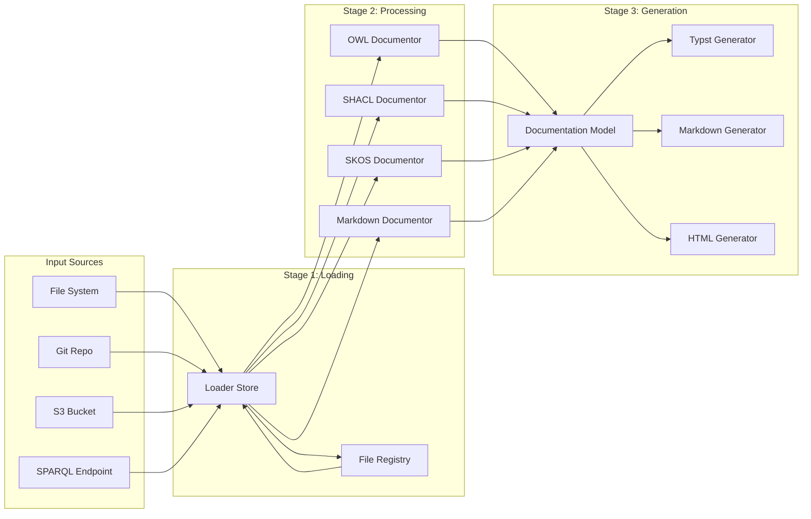

# Architecture

## Overview

GraphArch is a flexible and extensible documentation generation tool designed to be a Swiss Army knife for documentation needs. It can process various input sources and generate documentation in multiple output formats, making it a versatile solution for different documentation scenarios.

## Core Concepts

### 1. Input Sources

GraphArch supports two main categories of input sources:

#### File-Based Sources
- **File System**: Process local files and directories
- **Git Repositories**: Scan and process files from Git repositories
- **S3 Buckets**: Access and process files from S3 storage

Each file-based source implements the `FileSource` trait, providing consistent file access patterns and directory traversal capabilities. The implementation is provided through the `FileSourceImplementor` enum which currently supports:
- `LocalDirectorySource`: For local file system access
- `GitRepositorySource`: For Git repository access
- `S3BucketSource`: For S3 bucket access

#### Database-Based Sources
- **SPARQL Endpoints**: Query and process data from RDF databases (planned)
- **Database Connections**: Support for various database types (planned)

Database sources will implement a separate trait (e.g., `DatabaseSource`) that handles connection management, query execution, and result processing. This is currently planned for future implementation.

### 2. Data Loading and Storage

The tool uses a two-stage data processing approach:

#### Loader Store
- An in-memory triplestore (currently using [OxiGraph](https://github.com/oxigraph/oxigraph))
  that stores the raw data from input sources
- Optimized for performance with future plans for persistence
- Includes a file registry system that:
  - Tracks loaded files using SHA-256 hashes
  - Stores file metadata (size, creation time, modification time)
  - Maintains relationships between file contents and file paths
- Provides methods for:
  - Registering new files
  - Inserting RDF quads
  - Querying the store using SPARQL
- Stores data in RDF format, enabling semantic querying and processing

#### Documentation Model
- A separate triplestore that holds processed, documentable content
- Strictly follows the GraphArch ontology for all stored data
- Provides a Rust API for adding and manipulating documentation elements:
  ```rust
  // Example of the Rust API
  struct Book {
      title: String,
      authors: Vec<String>,
      // ... other fields defined in GraphArch ontology
  }

  struct Section {
      title: String,
      description: Option<String>,
      // ... other fields defined in GraphArch ontology
  }

  struct Chapter {
      title: String,
      content: String,
      // ... other fields defined in GraphArch ontology
  }

  impl DocumentationModel {
      fn add_book(&self, book: Book) -> Result<()>;
      fn add_section(&self, section: Section) -> Result<()>;
      fn add_chapter(&self, chapter: Chapter) -> Result<()>;
      // ... other methods for ontology-defined elements
  }
  ```
- Transforms raw data into documentation structure:
  - OWL Ontologies → Books
  - OWL Classes → Chapters within Sections
  - OWL Properties → Additional chapters
  - Labels and comments → Content and descriptions
- All SPARQL queries and RDF manipulation are encapsulated within the model module
- External code interacts only with Rust structs and methods, never directly with RDF
- The model module may be extracted into a separate crate in the future
- Uses Dublin Core terms for metadata as defined in the GraphArch ontology:
  - `dc:title` for document titles
  - `dc:creator` for authors
- Independent of output format, allowing for flexible documentation generation
- Enables cross-referencing and linking between different parts of the documentation

### 3. Documentors

Documentors are specialized processors that:
- Scan the Loader Store for specific types of documentable content
- Transform raw data into structured documentation elements
- Add processed content to the Documentation Model

Currently implemented documentors:
- **OWL Ontology Documentor**:
  - Processes OWL ontologies and their classes
  - Creates a Book for each ontology
  - Creates a Section for the ontology's classes
  - Creates Chapters for each OWL class
  - Transforms labels and comments into documentation content
  - Supports iteration over OWL classes for detailed processing

Planned documentors:
- SHACL Documentor: For processing SHACL shapes
- SKOS Documentor: For processing SKOS taxonomies
- Markdown Documentor: For processing markdown content
- Additional support for ODRL, DCAT, DPROD, Croissant

Each documentor implements the `Documentor` trait with:
- `file_types()`: Returns supported file types
- `generate()`: Processes content and updates the Documentation Model

### 4. Output Generators

Output generators transform the Documentation Model into specific output formats:

- **Typst Generator**: Produces PDF documentation using [Typst](https://typst.app/docs/)
  - Typst is just as capable (if not more) as LaTeX
- **Markdown Generator**: Creates Markdown files
- **HTML Generator**: Generates static websites
- (Future) Support for additional output formats

Each generator:
- Reads from the Documentation Model
- Transforms the abstract documentation structure into format-specific content
- Handles cross-referencing and linking appropriately for its output format

## Data Flow

The tool follows a three-stage data processing pipeline:



Each stage has a specific responsibility:

1. **Input Processing**: Various sources feed their data into the Loader Store
2. **Content Processing**: Documentors analyze the Loader Store and build the Documentation Model
3. **Output Generation**: Generators transform the Documentation Model into final documentation

The diagram shows how:
- Multiple input sources can feed into the Loader Store
- The File Registry tracks and manages loaded files
- Different documentors can process the same data in the Loader Store
- All documentors contribute to the same Documentation Model
- Multiple generators can create different output formats from the same Documentation Model

## Future Enhancements

- [ ] Persistent Loader Store with caching
- [ ] Additional input source types (SPARQL endpoints, databases)
- [ ] More documentable content types (SHACL, SKOS, etc.)
- [ ] New output format generators
- [ ] Enhanced cross-referencing capabilities
- [ ] Improved performance optimizations

## Technical Implementation

The tool is implemented in Rust, leveraging:

- Async/await for efficient I/O operations
- Trait-based abstractions for extensibility
- RDF/SPARQL for semantic data processing (encapsulated in model module)
- Strong type system for safety and maintainability
- OxiGraph for RDF storage and querying
- Tokio for async runtime
- Clap for command-line interface

### Module Structure and Rules

#### Model Module (`src/model`)
- Core data structures and business logic
- Exclusive owner of the SPARQL queries regarding the Documentation Model
- Provides type-safe Rust API for other modules to interact with documentation data
- All communication with other modules must be through Rust structs and methods
- No direct SPARQL exposure to external modules

#### Generator Module (`src/generator`)
- Handles transformation of Documentation Model into various output formats
- Must use the API of the DocumentationModel, never direct SPARQL queries
- Implementations:
  - Console Generator: ANSI-colored terminal output
  - Typst Generator: PDF documentation
  - Markdown Generator: Markdown files
  - HTML Generator: Static websites

#### Source Module (`src/source`)
- Handles input source management
- Abstracts file system, Git repositories, S3 access, database access
- Primary traits are `Source`, `FileSource` and `DatabaseSource`
- Provides unified interface for reading source content
- Responsible for source traversal and content extraction

#### Loader Module (`src/loader`)
- Manages loading of source content into the so-called Loader Store
- Primary trait is `Loader`
- Every `Loader` implementation handles a different file format (e.g. RDF, Markdown, etc.)
- Maintains file registry and content tracking
- Coordinates with Source module for content access

#### Documentor Module (`src/documentor`)
- Processes raw content, as stored by the `Loader`s into the Loader Store,
  into documentation structures like Books, Chapters etc, that are handled
  by the `DocumentationModel`.
- Transforms source-specific content (OWL, SHACL, SKOS, etc.) into generic documentation elements
- Works with Model module to create proper documentation structure
- Must use Model's Rust API for all documentation operations

#### Store Module (`src/store`)
- Manages the raw data store (i.e. the Loader Store)
- Provides low-level store operations
- Coordinates with Loader module for content storage
- Maintains file registry system
- Used by the `Loader`s as their output store

#### Util Module (`src/util`)
- Common utilities and helper functions
- Shared types and constants
- Cross-cutting concerns like logging and error handling

#### RDF Const Module (`src/rdf_const`)

- Constants for common RDF predicates of various ontologies including the GraphArch ontology
- We want to leverage Rust type checking for every RDF predicate,
  rather than littering RDF predicates all over the place.

## Principles

The codebase follows these architectural principles:

1. Clear separation between raw data (Loader Store) and processed documentation (Documentation Model)
2. All RDF/SPARQL operations are isolated to the model module and must never leak outside
3. External code interacts with the Documentation Model through a type-safe Rust API
4. The GraphArch ontology defines the structure of all documentation data
5. Future extraction of the model module into a separate crate is supported
6. Each module has a single responsibility and clear boundaries
7. Inter-module communication happens through well-defined Rust types and traits

### Model Module Guidelines

The model module (`src/model`) has special responsibilities and restrictions:

1. All SPARQL queries to the Store must be contained within the model module
2. The Store field in DocumentationModel is private and must never be accessed directly
3. External code must use the type-safe Rust API methods provided by DocumentationModel
4. No SPARQL queries or RDF operations should be visible outside the model module
5. The model module is responsible for translating between RDF data and Rust types
